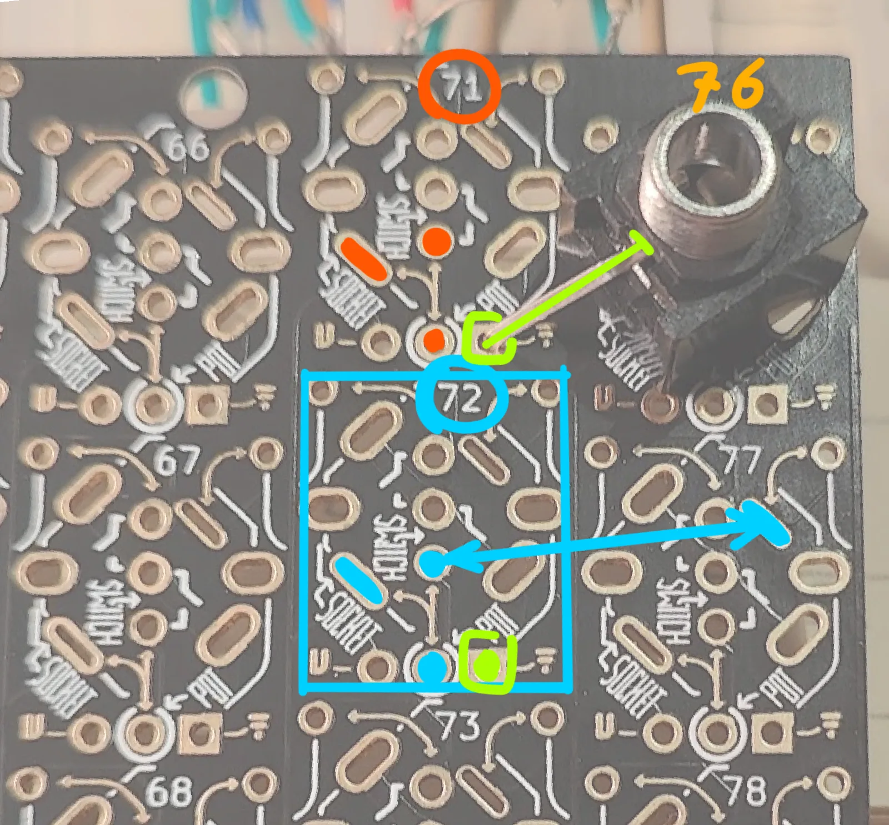
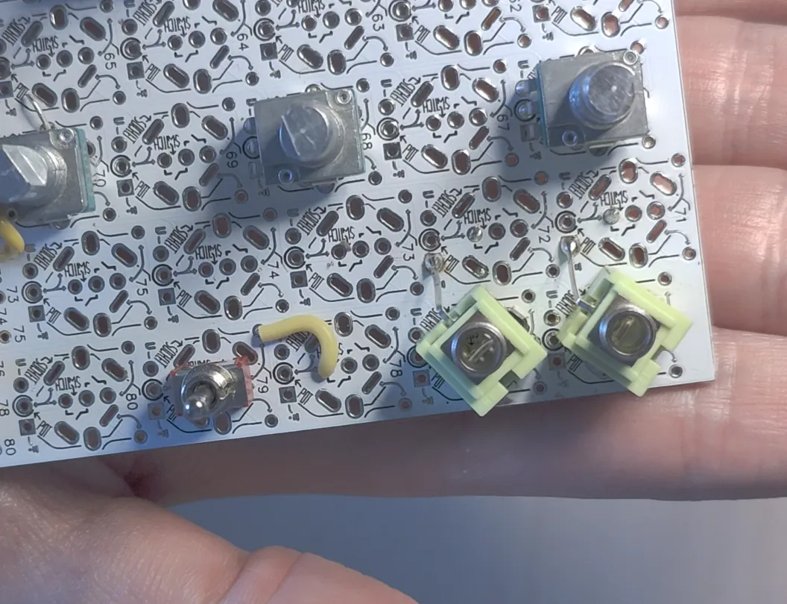

# Stereo I/O Mod (optional)

A stock Audrey II has two mono output jacks and no audio input. The firmware does
listen to the Daisy Seed audio inputs though: left and right are summed and fed
into the feedback loop alongside the internal noise. If nothing is connected to
the inputs, nothing changes.

So adding an input is a hardware-only mod. Two common approaches:

1. **Add one TRS input jack on the side (easiest).** Keep the existing mono
   outputs and mount a panel-mount stereo (TRS) jack in the side of the case.
   It doesn't touch the matrix, so it only needs three wires:
   - Tip (Left) → Synthux pin 16
   - Ring (Right) → Synthux pin 17
   - Sleeve → GND

   A mono (TS) cable also works: it simply feeds the left input.
2. **Swap the two mono jacks for TRS jacks.** Desolder the original mono jacks
   and replace them with stereo Thonkiconns, giving one stereo output and one
   stereo input on the same footprint. The rest of this page covers this option.

The audio pins 16–19 are on the side of the Daisy where the Synthux pin
numbers match the Seed pin numbers.

> Input level: the summed input is added straight into the feedback loop, so a
> hot stereo source can drive it harder than a mono one. Start with the source
> volume low.

## Option 2: swapping the jacks on the Designer PCB

> **Fit warning:** the stereo Thonkiconn (PJ366ST) does not sit in exactly the
> same place as the original mono jack, so the centre of the jack ends up
> slightly off from the original hole. This mod has not been tested with the
> official Audrey II faceplate. Check the alignment before soldering, and be
> ready to enlarge the panel holes slightly if needed.

For standard assembly reference, see the
[Audrey II Assembly Tutorial](https://tsemah.notion.site/Audrey-II-Assembly-Tutorial-1736331933b8809f8412f94f634622a5).

### Required components

- 2× Thonkiconn stereo 3.5 mm jacks (PJ366ST)

These TRS jacks provide Left (Tip), Right (Ring) and Ground (Sleeve).

### Desoldering the original jacks

Multi-pin parts can easily tear the PCB pads if forced out.

- The safest approach is to remove the original mono jacks destructively: cut
  the plastic body away from the top first.
- That leaves only the individual metal pins in the board, which you can then
  heat and pull out one by one.
- Adding a little fresh solder to each joint before heating helps the old solder
  flow and makes extraction easier.
- See this [short video on desoldering multi-pin components](https://youtube.com/shorts/9etvLoYCR0s?si=BeJnzQQqtzvRKzHb)
  before starting.

### How the matrix routing works

On the Designer PCB each jack footprint sits in a matrix slot. A slot's data pad
connects to the numbered pin at the bottom of its column (for example, slot 77 →
pin 77), which is then wired to a Synthux pin (for example, pin 19 for audio out).

A slot only has one data pad, so a stereo jack's second channel would be left
unconnected. The footprint has an isolated extra pad for the Ring. You bridge
that pad to the data pad of the unused slot next to it, and wire that slot's pin
to the Daisy like any other.

### Wiring reference

| Jack | Signal      | Jack pin | Matrix slot      | Synthux pin | Stock build     |
| :--- | :---------- | :------- | :--------------- | :---------- | :-------------- |
| Out  | Left Out    | Tip      | 76               | 18          | 76 → 18 (keep)  |
| Out  | Right Out   | Ring     | 71 (bridged)     | 19          | was 77 → 19     |
| Out  | Ground      | Sleeve   | neighbouring GND | –           | –               |
| In   | Left In     | Tip      | 77               | 16          | –               |
| In   | Right In    | Ring     | 72 (bridged)     | 17          | –               |
| In   | Ground      | Sleeve   | neighbouring GND | –           | –               |

In short, once the two TRS jacks are fitted in slots 76 and 77:

- **Bridge 2 pads:** Ring pad of 76 → slot 71, and Ring pad of 77 → slot 72.
- **Move 1 wire:** the existing wire from 77 → 19 moves to 71 → 19.
  The 76 → 18 wire stays as it is.
- **Add 2 wires:** 77 → 16 and 72 → 17.
- **Ground:** bend each jack's Sleeve pin onto the neighbouring GND pad (see below).

For an overview of all pins, see this
[pin table spreadsheet](https://docs.google.com/spreadsheets/d/1xtg_s1tk8tm-6qNkBLFc6V1L_Mpmu-PCOvv7qEyr9mU/edit?usp=sharing).

### Bridging the Ring pads

- **Output:** bridge the Ring pad at 76 to slot 71.
- **Input:** bridge the Ring pad at 77 to slot 72.

Short jumper wires on the back of the PCB work best:

### Grounding

The Thonkiconn's long Sleeve pin can be bent over just far enough to touch the
GND pad of the neighbouring footprint. Solder the two together, and no extra
ground wire is needed.

## Source

Adapted from
[Audio I/O Mod: Upgrading to Stereo TRS](https://github.com/jonwaterschoot/Feedback-Gardenscpr-for-Synthux-Audrey-II#audio-io-mod-upgrading-to-stereo-trs)
by Jon Waterschoot.
